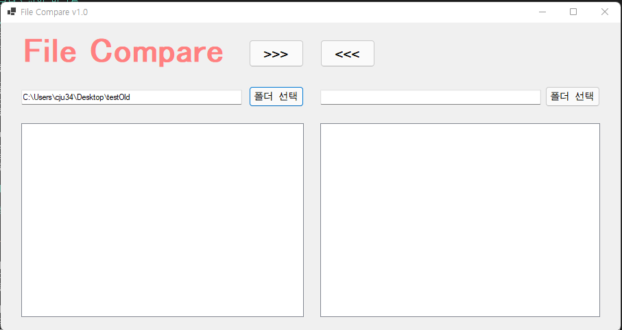
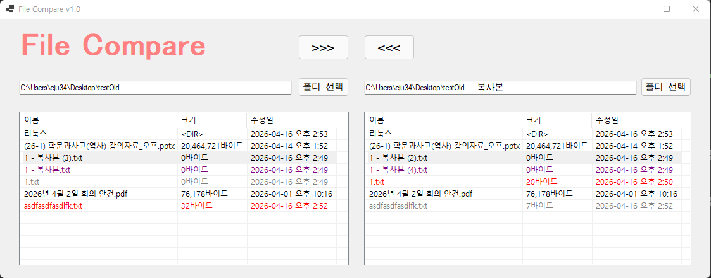
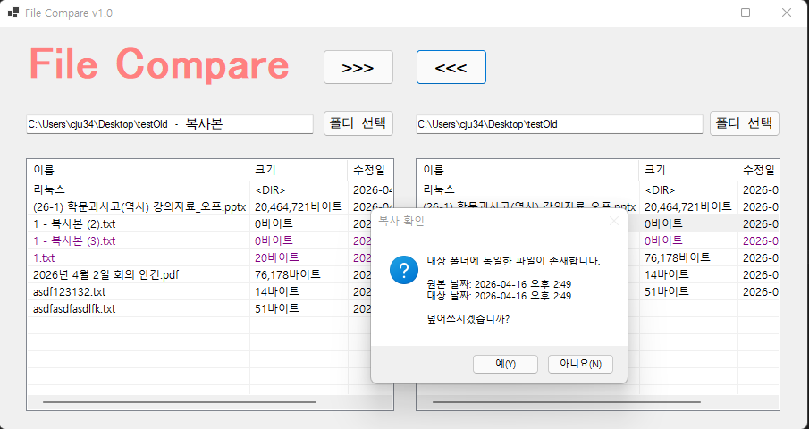

# (C# 코딩) 파일 비교툴

## 개요
- C# 프로그래밍 학습
- 1줄 소개:
  - 두 폴더 간의 파일 정보를 비교하고 상태별 색상 구분을 통해 효율적인 동기화를 돕는 파일 관리 도구
- 사용한 플랫폼:
  - C#, .NET Windows Forms, Visual Studio, GitHub
- 사용한 컨트롤:
  - Label, TextBox, Button, ListView, Panal, SplitContainer
- 사용한 기술과 구현한 기능:
  - FolderBrowserDialog를 활용한 표준 폴더 선택 인터페이스 구현
  - Directory 및 FileInfo 클래스를 이용한 실시간 파일 시스템 정보 추출
  - Try-Catch-Finally 구문을 적용한 입출력 예외 처리 및 프로그램 안정성 확보
  - ListView의 BeginUpdate/EndUpdate를 통한 리스트 갱신 성능 최적화
  - 컬럼 자동 너비 조정 기능을 통한 데이터 출력 가독성 개선

## 실행 화면 (과제1)
- 과제 1 코드의 실행 스크린샷

- 과제 내용
	- 사용자로부터 경로를 입력받거나 폴더 선택창을 통해 폴더를 지정합니다.
	- 지정된 폴더 내의 파일 목록을 읽어와 리스트뷰에 상세 정보를 출력합니다.

- 구현 내용과 기능 설명
	- using 구문과 FolderBrowserDialog를 사용하여 메모리 효율성을 높이고 안전하게 폴더 경로를 획득하도록 구현하였습니다.
	- Directory.EnumerateFiles를 사용하여 파일 목록을 가져오고, LINQ를 활용해 파일명 기준으로 오름차순 정렬하여 출력의 일관성을 유지하였습니다.
	- ListViewItem과 SubItems를 활용하여 파일명, 파일 크기, 최종 수정 시간을 상세하게 표시하였습니다.
	- DirectoryNotFoundException 및 IOException 처리를 통해 잘못된 경로 접근이나 파일 사용 중 오류 발생 시 프로그램이 강제 종료되지 않도록 설계하였습니다.

## 실행 화면 (과제2)
- 과제 2 코드의 실행 스크린샷

- 과제 내용
	- 양쪽 폴더를 선택하고 각 폴더 내의 파일 정보를 리스트뷰에 출력합니다.
	- 파일의 이름과 수정 시간을 비교하여 파일의 상태를 색상으로 구분해 표시합니다.

- 구현 내용과 기능 설명
	- 한쪽 폴더의 경로가 변경될 때마다 양쪽 리스트뷰를 동시에 갱신하여 비교 정보가 즉시 동기화되도록 구현하였습니다.
	- 상대방 폴더의 파일 목록을 Dictionary(Key: 파일명)로 관리하여 수많은 파일 사이에서도 검색 속도를 높였습니다.
	- DirectoryInfo를 활용해 하위 디렉토리를 추출하고, 파일 크기 열에 <DIR> 문구를 표시하여 일반 파일과 시각적으로 구분하였습니다.

## 실행 화면 (과제3)
- 과제 3 코드의 실행 스크린샷

- 과제 내용
	- 양쪽 폴더 사이에서 선택한 파일을 반대쪽 폴더로 복사하는 기능을 구현합니다.
	- 파일 덮어쓰기 시 수정된 날짜 정보를 사용자에게 보여주고 진행 여부를 확인합니다.

- 구현 내용과 기능 설명
	- Path.Combine을 사용하여 운영체제 경로 규칙에 맞는 안전한 복사 대상 경로를 생성하도록 구현하였습니다.
	- File.Exists를 통해 대상 폴더의 중복 파일 여부를 확인하고, MessageBox를 활용해 원본과 대상의 수정 시간을 비교하여 사용자 승인을 받는 절차를 추가하였습니다.
	- 복사 성공 횟수를 추적하는 로직을 도입하여, 사용자가 복사를 취소하거나 실패한 경우에는 완료 메시지가 발생하지 않도록 제어하였습니다.
	- 복사 작업 완료 후 UpdateAllListViews 메서드를 호출하여 변경된 파일의 상태 색상이 양쪽 리스트뷰에 즉시 반영되도록 설계하였습니다.